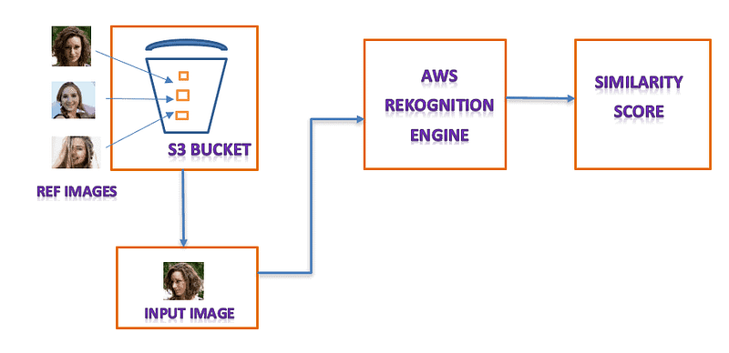

# Cloud project 2024 Amazon Rekognition for Facial Recognition and Analysis

Memory updated
Cloud Project 2024: Amazon Rekognition for Facial Recognition and Analysis
Here, I will learn and practice AWS Amazon Rekognition, building practical projects and strengthening my AWS skills.

Project Overview
1. Set Up Amazon Rekognition in AWS
Create an AWS Account: If you don't already have one, sign up at AWS.
IAM Role/Permissions: Create an IAM role with access to Rekognition and attach the AmazonRekognitionFullAccess policy for full access.
2. Upload Images to S3 Bucket
Create an S3 bucket to store the images you want to analyze.
Upload your images to the S3 bucket, which Rekognition will use to perform facial analysis.
3. DetectFaces API for Facial Analysis
The DetectFaces API detects faces in an image and provides attributes like:

Age range
Gender
Emotions (e.g., happy, sad, confused)
Facial landmarks (e.g., eyes, nose, mouth)
Smile detection
4. Automate with AWS Lambda
S3 Trigger: Create an S3 trigger to invoke a Lambda function when a new image is uploaded.
Lambda Code in file attact in folder

5. Monitor with CloudWatch
Use Amazon CloudWatch for performance monitoring and logging issues during Lambda function execution.

# 📆 Progress
I will update this README file regularly to document my progress. Here's an overview of my journey so far:

# 🏅 Goals
Here, I will learn and practice AWS Amazon Rekognition, building practical projects, and strengthening my AWS skills.

# 🎯 Conclusion
Amazon Rekognition offers scalable facial recognition and analysis, enabling you to detect emotions, facial landmarks, and match faces against known collections. By integrating Rekognition with S3 and Lambda, you can build automated, serverless applications.

Connect with me:

Instagram: @coderjourneys
Email: hetvi4448shah@gmail.com
LinkedIn: Hetvi Shah
Support: Buy me a coffee ☕
Let's code and make the most out of this amazing learning experience! 💪🔥
